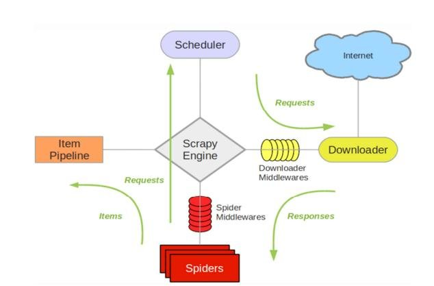
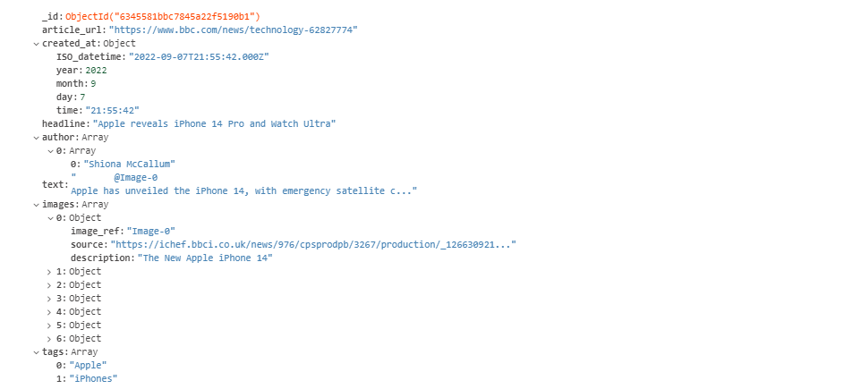

# news_crawler
This project uses the Scrapy framework to scrape bbc news' website.

## Below is [the architecture of Scrapy](https://docs.scrapy.org/en/0.22/topics/architecture.html)


### and this is how it is implemented in this project:
* __Spiders__:
There is one spider in news_crawler/spiders/articles.py</br>
The spider initiates a request to the internet (bbc.com) in our case, and after the 1)request and 2)response have been proccessed by middlewares, the spider 3)processes the response and sends the 4)result to the pipelines.</br>
If we wante to add another website to parse, we can add another spider.
* __Middlewares__: There are two middlewares in news_crawler/middlewares.py </br>
One for processing the request and response to make sure the request URL has never been processed before, and the response's status is 200.</br>
Another to generate random user-agents and change upon each request in order not to get banned</br>
* __Pipelines__: There is one pipeline in new_crawler/pipelines.py</br>
This pipeline gets the result from the spider and stores them in MongoDB database.
</br></br>

## Technical Implementation
* __loggings__: Used Scrapy's logging instances to add more loggings. All logs are inside logs/ directory.
* __unit testing__: A test.py file to test the results before storing in MongoDB.</br>To run the test:
```
python3 test.py
```
* __style__: PEP 8 style.
* __database__: MongoDB</br>
Each record is save as such:

* __server__: Flask, served with Gunicorn in a dockerized environment, and ScrapyRT which provides API for making requests with spiders, since scrapy cannot be used with Flask. Thus when the two servers and running, Flask calls the ScrapyRT endpoint which triggers the crawl function.</br>
Which turned out to be the best solution since ScrapyRT by itself does not use any authentication algorithm.
``` python
@app.route("/scrape")
@jwt_required()
def scrape():
    params = {
        'spider_name': 'news_crawler',
        'start_requests': 'true'
    }
    response = requests.get('http://localhost:9080/crawl.json', params=params)
    return make_response(f'{response}', 200,
                         {'message': "Success"})
```
</br>

## Three ways to run the project
Clone the repository, go the working directory. Make sure to rename .env.example to .env and to assign credentials to the variables accordingly.
### 1) Using Docker
Create a docker network
```
$ docker network create --driver bridge crawler-net
```
Build and run the containers
```
$ docker compose -f docker-compose.yml up -d --build
```
Then the Flask server would be up and running on your machine's ip address and port 1337 </br>
Check app.py for the endpoints.
One of the endpoints is used to provide the URLs, and another to scrape. Alongside other endpoints.

### 2) Serving Flask with gunicorn/uwsgi without Docker
On ubuntu:

```
$ scrapyrt -S news_crawler.settings
$ gunicorn --bind 0.0.0.0:8000 wsgi:app
```
On windows (since gunicorn does not work on windows)
```
$ pip install uwsgi
$ uwsgi --http 0.0.0.0:8000 --master -w wsgi:app
```
Then the Flask server would be up and running on your machine's local ip address on port 8000 </br>
ScrapyRT on port 9080</br>
Check app.py for the endpoints.</br>
One of the endpoints is used to provide the URLs, and another to scrape. Alongside other endpoints.

### 3) Using the command line
```
$ scrapy crawl news_crawler
```
where news_crawler is the name of the spider specified in news_crawler/articles.py
```python
class ArticleSpider(scrapy.Spider):
    # the name of the crawler
    name = 'news_crawler'
    ...
```
### 4) Using ScrapyRT
Run
```
$ scrapyrt -S news_crawler.settings
```
then use the following endpoint:

http://localhost:9080/crawl.json?spider_name=news_crawler&start_requests=true
